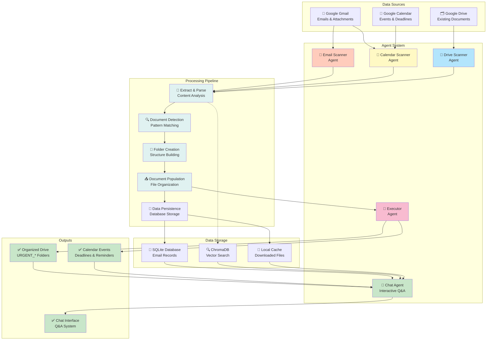

## System Architecture Overview

This diagram shows the complete data flow through the system:

**Data Flow Stages**:

1. **Input Stage**: Data from Gmail, Drive, and Calendar
2. **Agent Stage**: Five specialized agents process data
3. **Processing Pipeline**: Extract → Detect → Organize → Populate → Track
4. **Storage Stage**: SQLite, Vector DB, and local cache
5. **Output Stage**: Organized Drive, Calendar events, Chat interface

**Key Flows**:
- Primary flow (solid lines): Main data processing path
- Secondary flow (dotted lines): Vector indexing for chat search
- Feedback loops: Agents cross-reference each other's results

See individual agent diagrams for detailed workflows.
