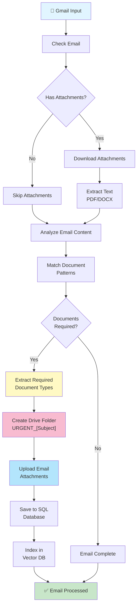

### Email Scanner Agent - Detailed Workflow

**Phase 1: Email Retrieval**
- Connects to Gmail via OAuth2
- Fetches unread and recent emails
- Extracts email metadata (from, subject, date)

**Phase 2: Content Analysis**
- Downloads all email attachments
- Extracts text from PDF/DOCX files
- Analyzes email body for requirements

**Phase 3: Document Detection**
- Runs regex patterns against content
- Identifies required document types
- Extracts deadline hints

**Phase 4: Folder Organization**
- Creates Drive folder: `URGENT_[Email Subject]`
- Uploads attachments to folder
- Generates shareable link

**Phase 5: Data Persistence**
- Saves email record to SQLite
- Indexes content in ChromaDB
- Stores attachments metadata

**Output**: Structured email data with:
- `sender`: Email sender
- `email_title`: Subject line
- `email_body`: Full body text
- `requires_documents`: Boolean flag
- `required_documents`: List of document types needed
- `drive_folder_id`: Google Drive folder ID
- `drive_folder_url`: Shareable Drive link
- `attachments`: List of downloaded files
