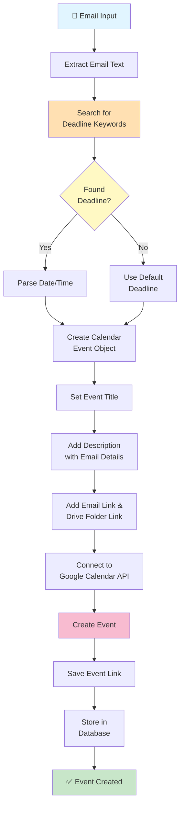

### Calendar Scanner Agent - Detailed Workflow

**Phase 1: Email Analysis**
- Receives email from Email Scanner
- Extracts full email text
- Searches for deadline indicators

**Phase 2: Deadline Extraction**
Recognizes keywords:
- "urgent", "deadline", "submit by"
- "due date", "expires", "valid until"
- "application closes", "registration deadline"

**Phase 3: Date/Time Parsing**
- Extracts specific dates if mentioned
- Uses defaults for missing dates
- Calculates relative dates ("2 weeks from now")

**Phase 4: Calendar Event Creation**
- Generates event object with:
  - Title: Email subject + document type
  - Date: Extracted deadline
  - Time: 9:00 AM (default)
  - Description: Email summary + requirements
  - Links: Email link + Drive folder

**Phase 5: Google Calendar Integration**
- Authenticates with Google Calendar API
- Creates event in primary calendar
- Returns event link and ID

**Phase 6: Persistence**
- Stores event record in SQLite
- Tracks event creation status
- Enables later reference in chat

**Output**: Calendar event data with:
- `summary`: Event title
- `start_date`: Event date
- `deadline_hint`: Extracted deadline
- `calendar_link`: Shareable event link
- `email_reference`: Link to original email
