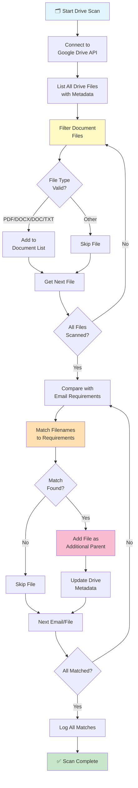

### Drive Scanner Agent - Detailed Workflow

**Phase 1: Drive Connection**
- Authenticates with Google Drive API
- Establishes secure connection
- Retrieves user's Drive root

**Phase 2: File Discovery**
- Lists all files in Drive
- Extracts metadata:
  - File name, ID, size
  - MIME type, created date
  - Parent folders, sharable links

**Phase 3: Document Filtering**
Valid document types:
- PDF files (.pdf)
- Word documents (.docx, .doc)
- Text files (.txt)
- Google Docs (converted format)

**Phase 4: Requirement Matching**
For each email requiring documents:
1. Extract required document types
2. Search Drive filenames for matches
3. Check file content if available
4. Score match confidence

**Phase 5: Folder Population**
- Adds matched files to email folder
- Uses Drive API `addParents` operation
- Preserves original file location
- Adds as "link" in email folder

**Phase 6: Tracking & Logging**
- Records all matched files
- Logs unmatched requirements
- Tracks failures and retries
- Provides detailed status

**Output**: Populated email folders with:
- All email attachments
- Matching Drive documents
- Organized by document type
- Web-accessible links

**Document Type Matching Examples**:
```
Email requires: "Passport"
Drive files: "my_passport.pdf" ✓ MATCH
            "passport_scan.jpg" ✓ MATCH
            "old_passport.pdf" ✓ MATCH

Email requires: "Bank Statement"
Drive files: "chase_statement_2024.pdf" ✓ MATCH
            "bank_receipt.docx" ✗ NO MATCH
```
