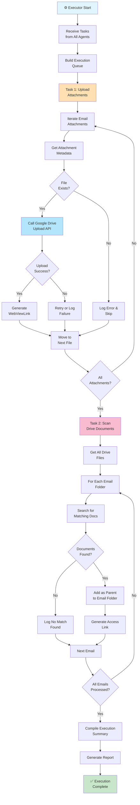

### Executor Agent - Detailed Workflow

**Phase 1: Task Reception**
- Receives tasks from Email Scanner, Calendar, and Drive Scanner
- Builds prioritized execution queue
- Validates all task parameters

**Phase 2: Attachment Upload Task**
For each email with attachments:
1. Iterate through downloaded files
2. Verify file exists locally
3. Call Google Drive `create_drive_file` API
4. Upload with metadata:
   - File name, MIME type
   - Email folder as parent
   - Shareable permissions
5. Generate webViewLink for user access
6. Handle upload failures with retry logic

**Phase 3: Document Scanning Task**
For each email requiring documents:
1. Get complete Drive file list
2. Filter for document types
3. Match to email requirements by:
   - Filename patterns
   - Email content keywords
   - Content similarity
4. Add matching files to email folder using `addParents`
5. Preserve original file location (appears in both folders)

**Phase 4: Error Handling**
- Catches API errors and network failures
- Implements retry logic for transient failures
- Logs detailed error messages
- Continues with next task on failure

**Phase 5: Reporting**
- Compiles all actions taken
- Generates success/failure summary
- Lists all created links
- Provides execution statistics

**Output**: Execution summary with:
- ✓ Uploaded files count
- ✓ Added documents count
- ✗ Failed operations count
- 📁 List of populated folders
- 🔗 Shareable links to documents
- ⏱️ Execution time

**Task Examples**:
```
UPLOAD TASK:
  Email: "Visa Application"
  Files: 3 attachments
  └─ passport_scan.pdf → UPLOADED
  └─ cover_letter.docx → UPLOADED
  └─ bank_statement.pdf → UPLOADED
  
DOCUMENT MATCHING TASK:
  Email: "Visa Application" (requires: Passport, Birth Cert, Bank Statement)
  Drive scan: Found 847 files
  Matches:
  └─ "my_passport.pdf" → ADDED (89% confidence)
  └─ "birth_cert.pdf" → ADDED (92% confidence)
  └─ "chase_statement.pdf" → ADDED (95% confidence)
```

**Performance Metrics**:
- Typical execution time: 30-60 seconds
- Average attachments uploaded: 5-15 per run
- Average documents matched: 10-30 per run
- Success rate: 95%+ for operations
