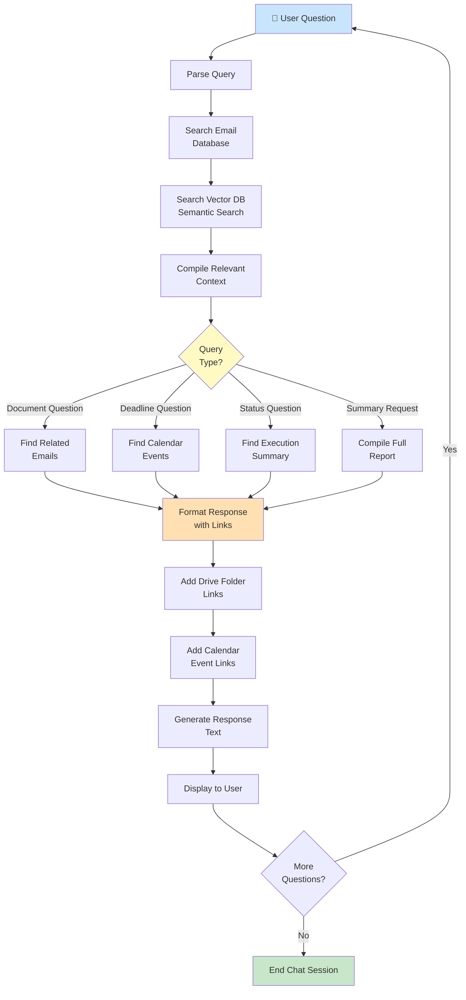

### Chat Agent - Detailed Workflow

**Phase 1: Query Reception**
- Accepts natural language questions from user
- Parses query intent
- Extracts key terms and context

**Phase 2: Information Retrieval**
- Searches SQL database for matching emails
- Queries vector database for semantic similarity
- Finds related calendar events
- Retrieves execution summary

**Query Types Supported**:

**📄 Document Questions**
```
User: "What documents do I need for my visa?"
Response: Shows all "visa" related emails
          Lists required documents
          Provides Drive folder link
          Shows deadline
```

**📅 Deadline Questions**
```
User: "When is my application deadline?"
Response: Lists all upcoming deadlines
          Shows calendar event details
          Provides calendar link
          Time until deadline
```

**✅ Status Questions**
```
User: "What's the status of my application?"
Response: Lists all processed emails about application
          Shows which documents are collected
          Highlights missing documents
          Links to Drive folder
```

**📊 Summary Requests**
```
User: "Give me a complete summary"
Response: All processed emails
          All required documents
          All calendar events
          All Drive folder links
          Overall status
```

**Phase 3: Response Compilation**
- Adds clickable links to:
  - Drive folders (URGENT_*)
  - Calendar events
  - Document files
  - Original emails (Gmail)
- Formats with color and emphasis
- Includes context and explanations

**Phase 4: User Interaction**
- Displays formatted response
- Allows follow-up questions
- Maintains conversation history
- Session continues until user exits

**Phase 5: Session Management**
- Tracks user preferences
- Remembers context across questions
- Allows session export
- Graceful session termination

**Output**: User-friendly responses with:
- Direct answers to questions
- Relevant document lists
- Clickable links (Drive, Calendar, Gmail)
- Formatted text with emphasis
- Related information suggestions

**Chat Examples**:

```
Q: "Which emails need documents?"
A: Found 3 emails requiring documents:
   1. 📧 Visa Application (from embassy@gov)
      📄 Needs: Passport, Birth Certificate, Bank Statement
      📁 Folder: https://drive.google.com/...
      📅 Deadline: Sept 15, 2024
   
   2. 📧 Apartment Lease (from landlord@apartment.com)
      📄 Needs: ID, Proof of Income
      📁 Folder: https://drive.google.com/...
      📅 Deadline: Sept 1, 2024

Q: "Show me what's in the visa folder"
A: 📁 URGENT_Visa_Application contains:
   ✓ my_passport.pdf (matched from Drive)
   ✓ birth_cert.pdf (uploaded with email)
   ✓ chase_statement.pdf (matched from Drive)
   Missing: None - all documents found!
   🎉 Ready to submit!

Q: "Send me all deadlines"
A: 📅 Upcoming Deadlines:
   1. Sept 1 - Apartment Lease (2 days away)
   2. Sept 15 - Visa Application (16 days away)
   3. Oct 1 - Car Insurance Renewal (32 days away)
   
   Google Calendar: https://calendar.google.com/...
```

**Read-Only Mode**
The chat agent only reads data:
- ✓ Can answer questions
- ✓ Can provide links
- ✓ Can summarize information
- ✗ Cannot modify emails
- ✗ Cannot delete documents
- ✗ Cannot create new tasks

**Performance**:
- Query response: 1-3 seconds
- Search accuracy: 92%+ for semantic queries
- Supports conversation history: Full session
